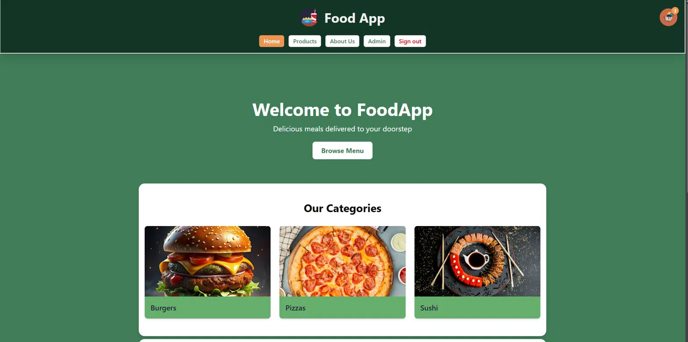
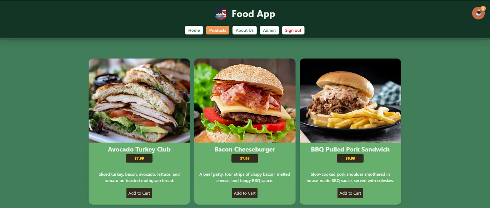
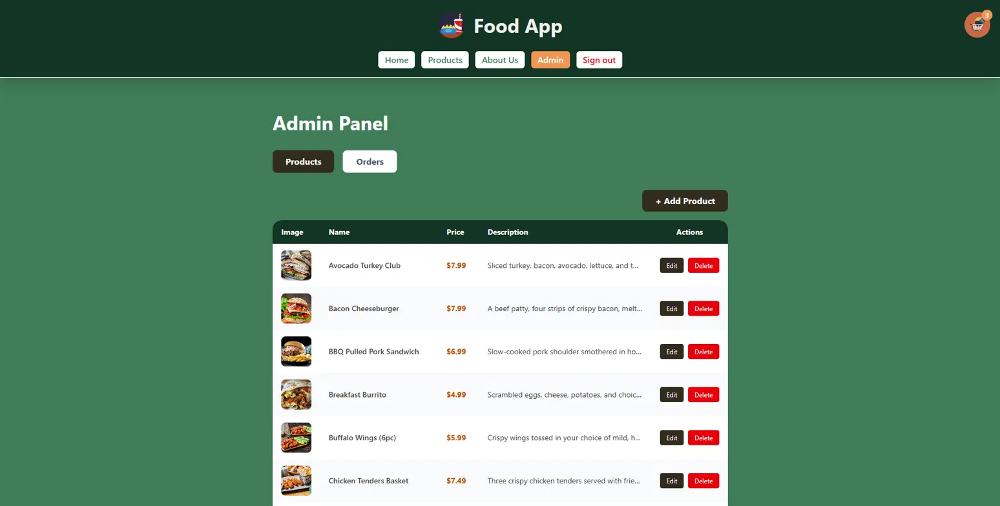
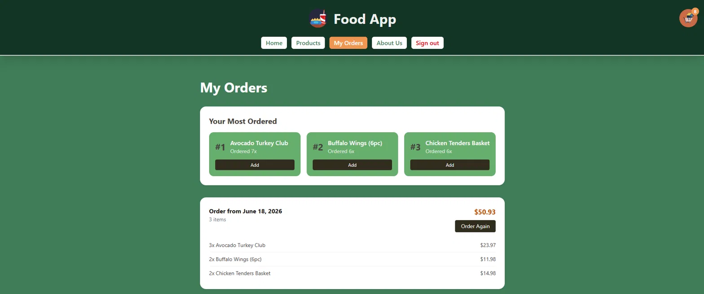
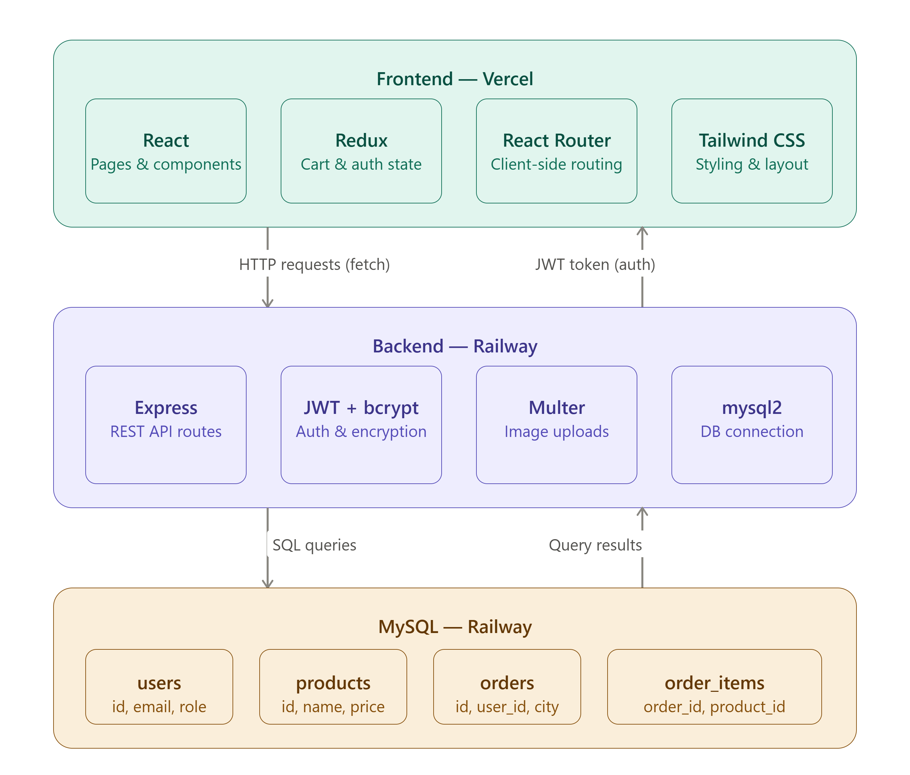

# 🍔 Food App

A full-stack food ordering app where users can browse a menu, add items to their cart, place orders, and track their order history — with a complete admin panel for managing products and orders.

**Live Demo:** [food-app-t3vr.vercel.app](https://food-app-t3vr.vercel.app)

---

## Screenshots






---

## Tech Stack

**Frontend**
- React 19
- Redux Toolkit (cart and auth state management)
- React Router v7 (client-side routing)
- Tailwind CSS (styling)
- Vite (build tool)

**Backend**
- Node.js + Express
- MySQL (database)
- JWT (authentication)
- bcrypt (password hashing)
- Multer (image uploads)
- Deployed on Railway

---

## Architecture



--- 

## Features

### Home
- Hero banner with a Browse Menu call to action
- Featured category cards (Burgers, Pizzas, Sushi)
- Popular Items section — dynamically populated from real order data
- Why Choose Us section highlighting key selling points

### Products
- Full product grid with name, image, price, and description
- Filter by category (Burgers & Sandwiches, Pizzas, Sushi)
- Individual product detail page with full description and Add to Cart button
- Cart icon with item count badge in the navigation bar

### Cart & Checkout
- Slide-in cart modal with quantity controls for each item
- Cart persists per user in localStorage across page refreshes
- Checkout form collecting name, email, street, postal code, and city
- Order submitted to the backend and linked to the logged-in user
- Toast notifications when items are added to the cart

### Authentication
- User registration and login with JWT tokens
- Passwords hashed with bcrypt before storage
- Auth state persisted in localStorage for session continuity
- Role-based navigation — admin users see the Admin link, regular users see My Orders

### Order History
- View all past orders with date, items, and total price
- **Your Most Ordered** section showing the user's top 3 most ordered products
- **Order Again** button to re-add all items from a past order to the cart

### Admin Panel
- **Products tab** — full CRUD: add, edit, and delete products with image upload support
- **Orders tab** — view all customer orders with customer details, items, totals, and date
- Mobile-responsive: orders display as cards on small screens, table on desktop
- Protected route — only accessible to users with the admin role

### General
- Fully responsive — works on mobile and desktop
- SPA routing with React Router — no page reloads

---

## Use Case

Food App is built to simulate a real-world restaurant ordering platform. Customers can browse a categorized menu, add items to a persistent cart, and place orders through a checkout flow. Admins can manage the full product catalogue and monitor incoming orders — making it a complete end-to-end ordering solution suitable for a small restaurant or food delivery service.

---

## Project Structure

```
shop-app/
├── backend/
│   ├── middleware/
│   │   └── auth.js
│   ├── public/
│   │   └── images/
│   ├── app.js
│   └── db.js
├── src/
│   ├── components/
│   │   ├── Cart.jsx
│   │   ├── CartItem.jsx
│   │   ├── CartToast.jsx
│   │   ├── Checkout.jsx
│   │   ├── Modal.jsx
│   │   ├── NavigationBar.jsx
│   │   └── ProductItem.jsx
│   ├── pages/
│   │   ├── AdminPage.jsx
│   │   ├── CategoryProducts.jsx
│   │   ├── HomePage.jsx
│   │   ├── LoginPage.jsx
│   │   ├── OrderHistoryPage.jsx
│   │   ├── ProductDetail.jsx
│   │   ├── Products.jsx
│   │   └── RegisterPage.jsx
│   └── store/
│       ├── authSlice.js
│       └── cartSlice.js
```

---

## Future Improvements

- **Payment integration** — add Stripe or PayPal for real payment processing
- **Order status tracking** — let admins update order status (pending, preparing, delivered) with real-time updates for customers
- **Search and filters** — add a search bar and price range filter on the products page
- **Product reviews** — allow customers to leave ratings and reviews on products they've ordered
- **Email notifications** — send order confirmation emails to customers after checkout
- **Discount codes** — support promo codes at checkout for discounts
- **Analytics dashboard** — show admins revenue charts, best-selling products, and order trends over time
